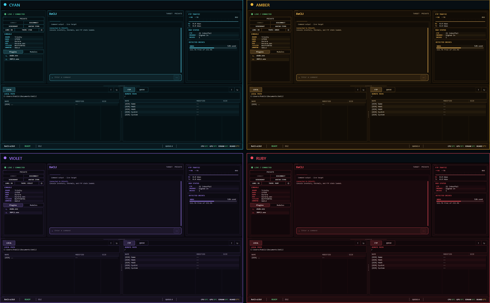

<p align="center">
  
</p>

<p align="center">
  A Windows command-line and desktop toolkit for Xbox 360 RGH/JTAG development, diagnostics, file management, and reverse-engineering workflows.
</p>

<p align="center">
  <a href="https://ko-fi.com/xecli"></a>
</p>

<p align="center">
  <a href="https://github.com/SaveEditors/xecli/releases">Downloads</a> ·
  <a href="https://github.com/SaveEditors/xecli/wiki">Documentation</a> ·
  <a href="SUPPORT.md">Support</a> ·
  <a href="SECURITY.md">Security</a>
</p>

Use `rgh.exe` for direct commands and automation, or open `XeTerminal.exe` for the connected desktop workspace. Both applications are included in every v2.0.0 package.

<p align="center">
  
</p>

## Install

Download XeCLI only from the official [GitHub Releases](https://github.com/SaveEditors/xecli/releases) page. Both packages are self-contained for x64 Windows and do not require a separate .NET installation. Windows 11 is recommended; see [Requirements](#requirements) for supported Windows 10 editions.

| Package | Choose it for | System behavior |
| --- | --- | --- |
| **Installer** — `XeCLI-2.0.0-win-x64-setup.exe` | A standard installed experience | Creates the XeCLI Start menu entry automatically. XeCLI desktop shortcut creation and adding `rgh` to `PATH` are optional. Installed-mode state uses Windows profile folders by default. |
| **Portable ZIP** — `XeCLI-2.0.0-win-x64.zip` | A movable or self-contained folder | Extract and run `rgh.exe` or `XeTerminal.exe`. It performs no installation or `PATH` changes and stores state under the package-local `UserData` folder by default. |

The installer defaults to `%LOCALAPPDATA%\Programs\XeCLI` for the current user or `%ProgramFiles%\XeCLI` for all users; either location can be changed in setup.

> **Unsigned release:** XeCLI v2.0.0 is intentionally unsigned. Windows may display **Unknown Publisher** or a SmartScreen warning. Verify the matching `.sha256` file from the Releases page before running either package.

```powershell
Get-FileHash .\XeCLI-2.0.0-win-x64-setup.exe -Algorithm SHA256
Get-Content .\XeCLI-2.0.0-win-x64-setup.exe.sha256

Get-FileHash .\XeCLI-2.0.0-win-x64.zip -Algorithm SHA256
Get-Content .\XeCLI-2.0.0-win-x64.zip.sha256
```

The hash printed by `Get-FileHash` must match the first value in its downloaded checksum file.

## Quick Start

After enabling the installer `PATH` option, close any terminal that was already open before setup and open a new one before running:

```powershell
rgh health
rgh start
rgh status
```

`rgh start` discovers a console and saves it as the default target. If discovery is unavailable, set the target directly with `rgh connect <console-ip>`. If you skipped `PATH` registration, run `rgh.exe` from the installation directory you selected. In the portable package, use `.\rgh.exe` instead of `rgh`; launch `.\XeTerminal.exe` for the desktop interface.

## Command Families

XeCLI v2.0.0 registers 62 root entries. The table groups every root entry by workflow; aliases and subcommands are documented in the full references.

| Family | Root entries | Typical work |
| --- | --- | --- |
| Connection and console identity | `status`, `profiles`, `title`, `target`, `target-saved`, `start`, `connect`, `scan`, `network`, `ping`, `language` | Discover consoles, select saved targets, inspect status, users, and title information |
| Power, launch, and desktop | `reboot`, `shutdown`, `launch`, `install`, `terminal`, `screenshot` | Start software, control power, open the interface, and capture the display |
| Live inspection and debugging | `xbdm`, `modules`, `module`, `mem`, `mem-bookmarks`, `threads`, `debug`, `trainer`, `xex`, `fs` | Inspect modules, memory, threads, breakpoints, files, and live XEX state |
| Console hardware and interaction | `jrpc2`, `notify`, `notify-icons`, `smc`, `fan`, `led`, `signin`, `tray`, `popup` | Use RPC helpers, notifications, hardware controls, sign-in state, and console prompts |
| Transfers, saves, and installed content | `ftp`, `save`, `content`, `plugin`, `avatar` | Transfer files, manage saves and content, configure plugins, and install avatar items |
| Local packages and storage | `con`, `profile`, `xdbf`, `xtaf`, `xtaf-cli`, `god` | Inspect or update local packages, profiles, GPD/XDBF data, FATX storage, and GOD output |
| XeLL, homebrew, and compatibility | `xell`, `homebrew`, `ogxbox` | Use XeLL backup workflows and stage supported homebrew or compatibility packages |
| Analysis integrations | `ghidra`, `ida` | Configure external analysis tools, export symbols, analyze, and decompile XEX files |
| Automation, reporting, and maintenance | `report`, `report-profile`, `script`, `log`, `health`, `diagnostics`, `support`, `release-notes`, `completion`, `release` | Build reports, run command files, review saved transcripts, export logs, diagnose configuration, and use local maintenance tools |

Run `rgh <root> --help` for built-in guidance. See the task-oriented [Commands Reference](https://github.com/SaveEditors/xecli/wiki/Commands) for examples and the exhaustive [CLI Help Output](https://github.com/SaveEditors/xecli/wiki/CLI-Help) for every canonical command path, argument, and option.

## What v2.0.0 Adds

- A production XeTerminal workspace with coordinated connection state, console details, telemetry, storage, inventory, traffic, settings, 19 themes, history search, quick actions, and local/remote file browsing.
- Strict XBDM response handling, bounded connection and read behavior, atomic settings writes, staged FTP transfers, and validated SMC and JRPC2 hardware readouts.
- Live module/RVA/Ghidra address resolution, breakpoint integration, memory sessions and bookmarks, saved map and dump comparison, and flat trainer workflows.
- Console reports and saved report profiles, script transcripts and offline transcript review, command-log export, shell completion, and redacted diagnostics and support bundles.
- FTP conflict review, sync and resume, remote hashes, local/remote comparison, optional transfer checksum verification, network diagnostics, recent-target history, and saved target profiles.
- Guided XeLL boot and information commands, keyvault export, integrity-checked NAND backups, XEX analysis bundles, and Ghidra/IDA symbol and decompilation helpers.
- Optional operator-supplied Title Database support and maintained local CON, profile, GPD/XDBF, XTAF, save, and content workflows. Mutations that must preserve a console-signed package require the operator's own decrypted keyvault.
- One supported self-contained `win-x64` runtime target delivered as an installer and portable ZIP.

Read [UPDATES.md](UPDATES.md) for the complete user-facing v2.0.0 summary.

## Requirements

- x64 Windows 11 is recommended. On Windows 10, Microsoft supports .NET 10 only on eligible Enterprise and LTSC releases (21H2, 1809, and 1607); the installer requires build 14393 or later. See the current [.NET support matrix](https://learn.microsoft.com/dotnet/core/install/windows#supported-versions).
- An Xbox 360 RGH/JTAG console with a compatible XBDM plugin for live console commands
- JRPC2 only for command families that use its RPC transport
- A compatible dashboard or DashLaunch FTP service for FTP workflows
- A local Ghidra or IDA installation only for the corresponding optional integrations

Run `rgh ftp check` when XBDM works but FTP does not. Run `rgh health` for local configuration, saved-target/profile, and command-log checks without connecting to a console.

## Documentation

Start with the [Beginner Guide](https://github.com/SaveEditors/xecli/wiki/Beginner-Guide), then use the [Commands Reference](https://github.com/SaveEditors/xecli/wiki/Commands) for task-oriented examples or [CLI Help Output](https://github.com/SaveEditors/xecli/wiki/CLI-Help) for the complete built-in command surface.

Focused guides cover [FTP requirements and file transfer](https://github.com/SaveEditors/xecli/wiki/FTP-and-File-Transfer), [reverse engineering](https://github.com/SaveEditors/xecli/wiki/Reverse-Engineering), [XeLL workflows](https://github.com/SaveEditors/xecli/wiki/XeCLI-XellFetch), [FATX/XTAF](https://github.com/SaveEditors/xecli/wiki/FATX-Manager), and [troubleshooting](https://github.com/SaveEditors/xecli/wiki/Troubleshooting).

## Data and Uninstall

Installed mode stores configuration under `%APPDATA%\XeCLI`, cache and the default command log under `%LOCALAPPDATA%\XeCLI`, and default XeTerminal captures under the Windows Pictures folder at `XeCLI\Captures`. Configured capture or log directories remain where you selected them. Upgrades preserve user settings, and uninstall leaves all of these user-owned locations untouched; remove them manually only when no longer needed.

Portable mode keeps configuration, cache, logs, and default captures under `UserData` beside the executables. Moving the complete extracted folder moves that state with it. In either mode, `XECLI_HOME` overrides the default state roots and stores configuration, cache, logs, and default captures in the directory it names.

## Support, Security, and Contributing

- Read [SUPPORT.md](SUPPORT.md) before opening a [GitHub issue](https://github.com/SaveEditors/xecli/issues).
- Report security concerns through the private process described in [SECURITY.md](SECURITY.md); never place secrets or sensitive console files in a public issue.
- Contributions are welcome under [CONTRIBUTING.md](CONTRIBUTING.md).

XeCLI is licensed under the [GNU General Public License v3.0](LICENSE). Dependency and bundled-component provenance is documented in [THIRD-PARTY-NOTICES.md](THIRD-PARTY-NOTICES.md).
