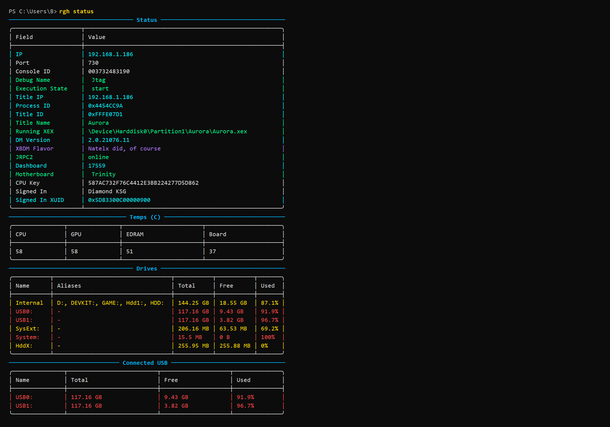

# XeCLI
[](https://github.com/SaveEditors/xecli)
[](https://www.gnu.org/licenses/gpl-3.0)
[](https://dotnet.microsoft.com/)
[](https://github.com/SaveEditors/xecli)

XeCLI is a terminal-first Xbox 360 RGH/JTAG toolkit built for live console work. It combines XBDM, JRPC2, FTP, XEX tooling, memory inspection, module control, screenshot capture, Ghidra headless automation, and Games on Demand conversion in one CLI and one release package.

The repository and product name are `XeCLI`. The installed terminal command is `rgh`.

## Documentation
- [Wiki Home](wiki/Home.md)
- [Commands Reference](wiki/Commands.md)
- [CLI Help Output](wiki/CLI-Help.md)
- [Beginner Guide](wiki/Beginner-Guide.md)
- [Advanced Guide](wiki/Advanced-Guide.md)
- [Published Docs Site](https://saveeditors.github.io/xecli/wiki/Home.html)

## Interface Preview
Top-level help:


Live status:



## Why XeCLI
XeCLI is designed for three kinds of work:

- Daily operator workflows: discovery, connection management, status, FTP, plugin control, and title launching.
- Reverse engineering workflows: module listing, memory reads and writes, thread context, breakpoints, XEX dumping, strings, and Ghidra export.
- Tool integration workflows: JSON output, bundled metadata, and stable command-based orchestration from scripts or companion apps.

It is intended to replace scattered one-off console utilities with a consistent command surface that can be used interactively or scripted.

## What Ships
The repository and release package include:

- The CLI source and managed project dependencies.
- Common console-side `.xex` dependency files used with XeCLI workflows.
- A bundled Title ID database.
- Ghidra helper scripts.
- Wiki documentation and release-facing README content.

Bundled assets:

- `src/Xbox360.Remote.Cli/ConsoleDependencies/xbdm.xex`
- `src/Xbox360.Remote.Cli/ConsoleDependencies/XDRPC.xex`
- `src/Xbox360.Remote.Cli/ConsoleDependencies/JRPC2.xex`
- `src/Xbox360.Remote.Cli/Assets/xbox360_gamelist.csv`
- `src/Xbox360.Remote.Cli/Assets/xbox360_titleids.txt`
- `src/Xbox360.Remote.Cli/ghidra_scripts/DecompileAllToC.java`

At publish time, these assets are copied into the release output so the package remains self-contained.

## What the Console Must Provide
XeCLI does not replace console-side plugins or services. The target console must already provide the pieces you want to use:

- XBDM for console control, module enumeration, memory access, threads, breakpoints, screenshots, and file-system commands.
- JRPC2 for CPU key, temperatures, Title ID, dashboard version, motherboard type, notifications, and generic RPC.
- FTP service for FTP-backed file browsing, save management, content management, and DashLaunch plugin edits.

XeCLI is shipped as a self-contained local toolchain and now includes common console-side `.xex` dependency files in `ConsoleDependencies/` for packaging convenience, but those services still have to be installed and enabled on the target console.

## Feature Summary
Core console workflows:

- Console discovery and saved default targeting.
- Fast `status`, `ping`, `profiles`, and `title` queries.
- Launch and reboot control with optional on-console success notifications.

Live inspection and debugging:

- Module list, info, dump, load, unload, and pending verification.
- Memory dump, hexdump, peek, poke, watch, strings, and pattern search with optional freeze writes.
- Thread list, context, suspend, and resume.
- Debug stop/go, code breakpoints, data breakpoints, and live debug-event watch.

File and content workflows:

- XBDM file-system access and FTP access.
- Save listing, extraction, and injection.
- Installed-content inventory and deletion.
- DashLaunch plugin listing and slot management.

XEX and analysis workflows:

- Dump the active XEX.
- Extract XEX strings from local files, FTP, or the running title.
- Run Ghidra headless analysis and decompile exports.
- Verify decompile output for bad-instruction placeholders.

Packaging and automation:

- ISO to Games on Demand conversion.
- Folder watchdog for unattended ISO processing.
- JSON output on automation-friendly commands.
- A bundled Title ID database that other tools can consume directly.

## Installation
### Release package
Download the release archive, extract it, and run `rgh.exe`.

Release contents:

- `rgh.exe`
- native .NET runtime files bundled beside `rgh.exe`
- `ConsoleDependencies/`
- `Assets/`
- `ghidra_scripts/`

The release package is self-contained for `win-x64`. It does not require a separate .NET runtime install on the target PC.

On first interactive launch from a packaged build, XeCLI offers a one-time prompt to add its directory to the machine PATH. That operation requires administrator approval and makes `rgh` available in new terminals.

Manual install commands:

```powershell
rgh install
rgh install --machine-path
```

### From source
```powershell
git clone https://github.com/SaveEditors/xecli
cd XeCLI
dotnet build -c Release
dotnet run --project src/Xbox360.Remote.Cli -- --help
```

Source builds require the .NET 10 SDK/runtime. That requirement does not apply to the published `win-x64` release archive.

## Quick Start
Discover and select a console:

```powershell
rgh start
```

If you already know the target:

```powershell
rgh target --set <console-ip>
rgh ftp target --set <console-ip> --user <ftp-user> --pass <ftp-pass>
```

Check the console:

```powershell
rgh ping
rgh status
rgh status --quick
rgh title
```

Inspect live state:

```powershell
rgh modules list
rgh modules info --name Aurora.xex
rgh mem hexdump --addr 0x30000000 --size 0x40
rgh screenshot --out .\screen.bmp
```

Work with saves, content, and plugins:

```powershell
rgh save list --titleid FFFE07D1 --device Hdd1
rgh content list --device Hdd1 --show-types
rgh plugin list
```

Run analysis workflows:

```powershell
rgh xex dump --out .\title.xex
rgh xex strings --running --unicode --min 6
rgh ghidra decompile --running --out .\decomp
```

## Active Title Resolution
`rgh title` with no arguments resolves the currently active title from the connected console.

Examples:

```powershell
rgh title
rgh title --json
rgh title 415608C3
rgh title 415608C3 2B7302D6
```

When the running XEX is a dashboard replacement or homebrew shell, XeCLI can prefer a path-based fallback name such as `Aurora` while still showing the bundled database entry separately.

## Module Load and Unload
Live module unload is supported and verified against the live module list. Module load is more nuanced: some plugin stacks and modules do not hot-load safely on every console.

Supported commands:

```powershell
rgh modules load --path Hdd:\HvP2.xex
rgh modules unload --name HvP2.xex --force
rgh modules pending
```

For modules that trigger a reboot or disconnect as part of load, use:

```powershell
rgh modules load --path Hdd:\HvP2.xex --system --reboot-expected
```

Then, after the console returns:

```powershell
rgh modules pending
```

That flow persists pending verification in the XeCLI config and confirms the final module state after reboot.

## Bundled Title ID Database
XeCLI includes its Title ID data in the repository and in the published release. It does not fetch title metadata from the internet at runtime.

Primary files:

- `src/Xbox360.Remote.Cli/Assets/xbox360_gamelist.csv`
- `src/Xbox360.Remote.Cli/Assets/xbox360_titleids.txt`

Optional local extension file:

- `%APPDATA%\XeCLI\titleids.local.csv`

The bundled data is useful beyond the CLI itself. Other tools can reuse it to:

- Resolve Title IDs into readable names.
- Match media-specific variants.
- Label saves, dumps, screenshots, and reports.
- Enrich launchers, dashboards, trainers, and save editors.

## Configuration
Primary config file:

- `%APPDATA%\XeCLI\config.json`

Cache directory:

- `%LOCALAPPDATA%\XeCLI\cache`

The config stores items such as:

- Default XBDM target.
- Default FTP target and credentials.
- Notification icon presets.
- Ghidra path configuration.
- Pending module operations that need post-reboot verification.

## Release Layout
The source repository is intended to stay clean:

- Source under `src/`
- Docs under `README.md` and `wiki/`
- No runtime dumps or captures checked into the repo
- No machine-specific paths in release documentation

Release artifacts should be built outside the repository root so publish output, dumps, screenshots, and smoke-test files do not pollute the source tree.

## Documentation Map
Start here:

- `wiki/Home.md`
- `wiki/Beginner-Guide.md`
- `wiki/Commands.md`

Deep reference:

- `wiki/Advanced-Guide.md`
- `wiki/Frameworks.md`
- `wiki/Title-ID-Database.md`
- `wiki/Integrations.md`
- `wiki/Troubleshooting.md`
- `wiki/FAQ.md`

## Safety Notes
XeCLI includes both safe operational commands and commands that can destabilize the running title or console session.

Treat these areas with care:

- `mem poke`
- `mem search --freeze`
- `debug break` and `debug databreak`
- `modules unload --force`
- `modules load --system`
- `reboot`
- content and save deletion commands

If a command is expected to trigger a reboot or disconnect, XeCLI should say so explicitly. Use the pending-verification flow where appropriate instead of assuming the operation completed cleanly.

## License
GPLv3
