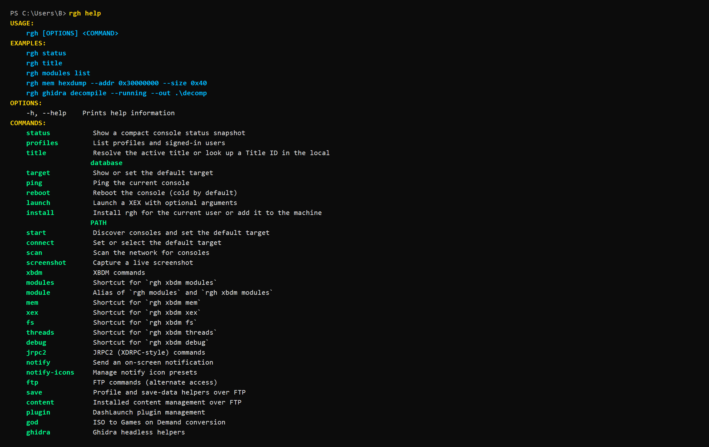
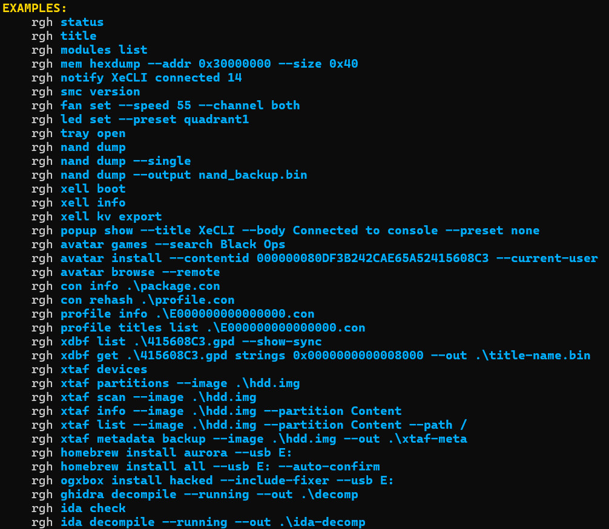

<p align="center">
  
</p>

[](https://ko-fi.com/saveeditors)</p>
XeCLI is a terminal-first Xbox 360 RGH/JTAG toolkit for live console work with XBDM, JRPC2, FTP, XeLL-backed NAND dumping, XEX tooling, memory inspection, content workflows, reverse-engineering helpers, and release packaging.

The repository and product name are `XeCLI`. The installed terminal command is `rgh`.


## What XeCLI Covers

- Live console status, title resolution, module inspection, memory inspection, thread control, screenshots, and debug helpers
- File-system and FTP workflows for browsing, transfer, search, save handling, plugins, and console content staging
- XeLL-backed keyvault export, CPU key capture, startup-log capture, and verified read-only NAND backup
- Local XTAF/FATX disk and image workflows with Windows disk enumeration, header scan, manual offset/length open, metadata backup/restore, safe repair, and raw partition export
- Local content tooling for CON, profile, GPD, and XDBF inspection and mutation
- Reverse-engineering helpers for Ghidra and IDA, plus XEX dump, decompile, and analysis flows
- Homebrew, dashboard, compatibility-pack, and USB staging workflows

## v1.0.8 Highlights

- Promoted `rgh xtaf` to the primary FATX/XTAF disk and image command surface while keeping `fatman` and `fatx` as compatibility aliases
- Separated XeCLI and `XeCLI-XellFetch` distribution paths so the desktop CLI and the standalone XeLL payload ship from their own repos
- Polished the Windows installer with bundled .NET runtime prerequisite handling, installer-owned language selection, and updated copy
- Kept the automated PC-side NAND workflow with `rgh nand dump` and the verified keyvault path with `rgh xell kv export`
- Kept verified-success reboot gating so the console only leaves XeLL after the PC confirms the dump is valid
- Kept same-session verification fallback for consoles that ignore XeLL reboot during the second pass

**Safety note:** Auto-reboot is disabled for `--single` and `--no-verify` so the console does not leave XeLL before the operator sees that verification was skipped.

## Quick Start

```powershell
.\XeCLI-1.0.8-setup-win-x64.exe
rgh --help
rgh language --set es
rgh nand dump --ip 192.168.1.186 --yes
```

Portable zip users can run `rgh.exe` directly from the extracted release folder. The installer exists to register `rgh`, install the bundled .NET runtime when needed, and persist the initial UI language selection.

## Documentation

- [GitHub Wiki](https://github.com/SaveEditors/xecli/wiki)
- [Beginner Guide](https://github.com/SaveEditors/xecli/wiki/Beginner-Guide)
- [Commands Reference](https://github.com/SaveEditors/xecli/wiki/Commands)
- [XTAF / FATX Manager](https://github.com/SaveEditors/xecli/wiki/FATX-Manager)
- [XeCLI-XellFetch](https://github.com/SaveEditors/xecli/wiki/XeCLI-XellFetch)
- [Troubleshooting](https://github.com/SaveEditors/xecli/wiki/Troubleshooting)
- [Release Notes](https://github.com/SaveEditors/xecli/wiki/Releases)

## Tooling Notes

Ghidra is an external `(Free)` dependency. XeCLI's supported Ghidra XEX import path uses the maintained [SaveEditors/XEXLoaderWV](https://github.com/SaveEditors/XEXLoaderWV) fork.

The IDA workflow is pinned to `IDA Pro 9.1.250226` with `idaxex 0.42b`.

## Why XTAF Matters

XeCLI's `rgh xtaf` surface is not limited to browsing normal Xbox 360 HDD images. The standout workflows are:

- Direct Windows physical-disk inspection alongside normal `.img` and `.bin` inputs
- FATX/XTAF header scan plus manual `--offset` and bounded `--length` opens for unusual or partial images
- Retail-layout FATX formatting for blank or recovered Xbox 360 HDD images
- Low-level metadata backup and restore for disk-prefix and partition-header regions before risky work
- Safe chain-map audit and repair for orphaned allocation issues
- Raw partition dump and tree extraction workflows for recovery or analysis

`rgh fatman` and `rgh fatx` still work as compatibility aliases, but `rgh xtaf` is now the primary disk and image command surface.

## Standalone Payload Repo

The standalone `XeCLI-XellFetch` repo is published at [github.com/SaveEditors/XeCLI-XellFetch](https://github.com/SaveEditors/XeCLI-XellFetch). It packages the custom `xell.bin`, `XellLaunch`, and `QuickBoot` assets for operators who want the XeLL-side payload with or without the full XeCLI desktop workflow. XeCLI integrates with that workflow, but the standalone bundle is released from its own repo.

## Release

- [Latest Release](https://github.com/SaveEditors/xecli/releases/latest)
- [Full Release Archive](https://github.com/SaveEditors/xecli/wiki/Releases)

## Screenshots




