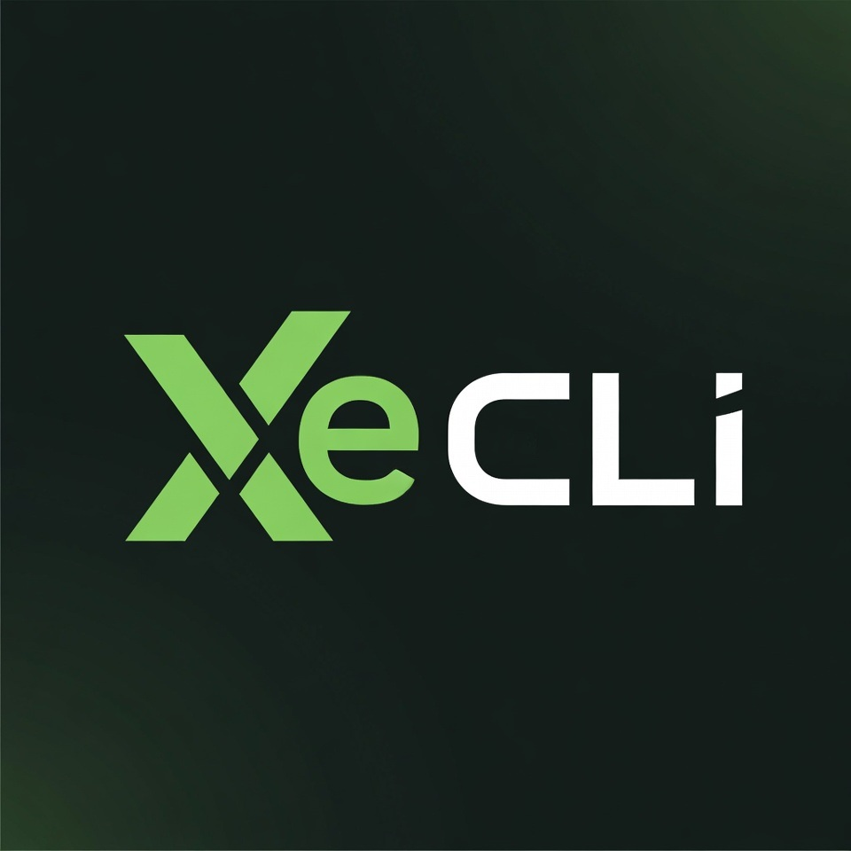

<p align="center">
  
</p>

# XeCLI
[](https://github.com/SaveEditors/xecli)
[](https://www.gnu.org/licenses/gpl-3.0)
[](https://dotnet.microsoft.com/)
[](https://github.com/SaveEditors/xecli)

XeCLI is a terminal-first Xbox 360 RGH/JTAG toolkit built for live console work. It combines XBDM, JRPC2, FTP, avatar browsing and remote avatar downloads, XEX tooling, memory inspection, module control, screenshot capture, Ghidra headless automation, pinned IDA Pro 9.1 headless reverse-engineering helpers, and Games on Demand conversion in one CLI and one release package. The same command surface also works cleanly from terminal agents such as Claude and Codex when you want repeatable console automation instead of a GUI-only workflow.

The repository and product name are `XeCLI`. The installed terminal command is `rgh`.

Ghidra remains an external `(Free)` dependency. The IDA workflow is pinned to `IDA Pro 9.1.250226` with `idaxex 0.42b`, and IDA Pro is required if you want the IDA debugger/decompiler workflow.

Created by [Pew7s](https://www.se7ensins.com/members/pepe-le-pew.527865/).

<p align="center">
  <strong>Support our work? Buy us a coffee!</strong>
</p>
<p align="center">
  <a href="https://ko-fi.com/saveeditors">
    
  </a>
</p>

## Documentation
- [Wiki Home](https://saveeditors.github.io/xecli/wiki/Home.html)
- [Latest Features](https://saveeditors.github.io/xecli/wiki/Latest-Features.html)
- [FTP and File Transfer](https://saveeditors.github.io/xecli/wiki/FTP-and-File-Transfer.html)
- [Commands Reference](https://saveeditors.github.io/xecli/wiki/Commands.html)
- [CLI Help Output](https://saveeditors.github.io/xecli/wiki/CLI-Help.html)
- [Beginner Guide](https://saveeditors.github.io/xecli/wiki/Beginner-Guide.html)
- [Hardware and System Controls](https://saveeditors.github.io/xecli/wiki/Hardware-and-System.html)
- [XNotify](https://saveeditors.github.io/xecli/wiki/XNotify.html)
- [Homebrew and USB](https://saveeditors.github.io/xecli/wiki/Homebrew-and-USB.html)
- [Original Xbox Compatibility](https://saveeditors.github.io/xecli/wiki/Original-Xbox-Compatibility.html)
- [Fatman](https://saveeditors.github.io/xecli/wiki/FATX-Manager.html)
- [Avatar Item Collection](https://saveeditors.github.io/xecli/wiki/Avatar-Item-Collection.html)
- [Advanced Guide](https://saveeditors.github.io/xecli/wiki/Advanced-Guide.html)
- [Reverse Engineering](https://saveeditors.github.io/xecli/wiki/Reverse-Engineering.html)
- [Integrations](https://saveeditors.github.io/xecli/wiki/Integrations.html)
- [Published Docs Site](https://saveeditors.github.io/xecli/wiki/)

## High-Value Workflows
- FTP and file work: save a target once, then browse, search, pull, push, rename, and delete directly from `rgh`.
- Avatar downloader and installer: use the local or hosted `Avatar-Item-Collection`, browse by game or item, cache remote packages, patch ownership, and install to the console.
- Claude/Codex-friendly automation: drive `rgh` from terminal agents, shell scripts, or companion tools with explicit commands and `--json` output where supported.
- Live debugging and reverse engineering: inspect modules, memory, threads, breakpoints, screenshots, XEX dumps, and both Ghidra and IDA output without switching tools.

## Release Changelog
### v1.0.4 IDA Debugger Support
- Added headless IDA Pro 9.1.250226 support with `rgh ida config`, `rgh ida check`, `rgh ida install-loader`, `rgh ida analyze`, `rgh ida decompile`, `rgh ida verify`, and the `rgh xex ida-decompile` shortcut for live-console XEX workflows.
- Pinned the supported IDA environment to `IDA Pro 9.1.250226` with `idaxex 0.42b`. IDA Pro is required to use the IDA debugger/decompiler workflow.
- Clarified the Ghidra workflow as an external `(Free)` dependency and added helper-loader install flows through `rgh ghidra install-loader`.
- Added the [Reverse Engineering](https://saveeditors.github.io/xecli/wiki/Reverse-Engineering.html) wiki page and updated the README, CLI help, commands reference, advanced guide, and FAQ to document the external tool requirements and supported loader versions.
- Added `rgh fatman` as XeCLI's integrated FATX image and storage manager, with `rgh fatx` kept as the documented alias for users who prefer the filesystem term directly.
- Added read-only FATX/XTAF image recovery commands for `devices`, `partitions`, `scan`, `info`, `list`, `find`, `cat`, `get`, `extract`, and `dump`.
- Added manual-open support with `--offset` and `--length` so nonstandard, partial, or dev HDD images can be inspected directly by byte range instead of relying only on the retail partition map.
- Added `rgh fatman scan` to surface plausible FATX/XTAF header offsets before manual-open workflows.
- Added the [Fatman](https://saveeditors.github.io/xecli/wiki/FATX-Manager.html) wiki page and updated the README, Home, Commands Reference, CLI Help, and sidebar so the new image-recovery workflow is documented consistently.

### v1.0.3 Original Xbox Compatibility Update
- Added `rgh ogxbox list` and `rgh ogxbox install <hacked|hud|retail>` so XeCLI can stage or install the three public XeFu compatibility packs with user-facing descriptions instead of leaving that setup manual.
- Added optional HDD Compatibility Partition Fixer staging and direct console deployment support, including `HddX:\Compatibility` targeting for the compatibility files and automatic placement of the fixer on a writable console drive when needed.
- Added the [Original Xbox Compatibility](https://saveeditors.github.io/xecli/wiki/Original-Xbox-Compatibility.html) wiki page and updated the README, Beginner Guide, Commands Reference, CLI Help, Homebrew and USB guide, Home page, and sidebar so the new workflow is documented consistently.
- Added a `Known Issues` note in the README to make the current spoofing stability caveat explicit.

### v1.0.2 Installer and Homebrew Update
- Split first-time setup and package staging cleanly so `rgh install` remains the XeCLI installer and `rgh homebrew install <package>` handles Aurora, DashLaunch, XeXMenu, Freestyle Dash, XM360, TimeFixer, Simple 360 NAND Flasher, and XellLaunch staging.
- Added `rgh ogxbox list` and `rgh ogxbox install <hacked|hud|retail>` for Original Xbox compatibility packs, with optional HDD Compatibility Partition Fixer staging and direct `HddX:\Compatibility` install support.
- Added a dedicated homebrew package catalog with cached downloads, archive extraction, generated `launch.ini`, bundled plugin copies, staging to removable USB drives or normal folders, and an explicit install confirmation prompt unless `--auto-confirm` is supplied.
- Kept silent backward compatibility for older `rgh install aurora` style calls by redirecting them to the new homebrew path without exposing that legacy syntax in public help.
- Fixed installer summaries and follow-up instructions so installs without PATH enabled now point users to the installed `rgh.exe` directly instead of telling them to run a missing `rgh` command.
- Added the [Homebrew and USB](https://saveeditors.github.io/xecli/wiki/Homebrew-and-USB.html) and [Original Xbox Compatibility](https://saveeditors.github.io/xecli/wiki/Original-Xbox-Compatibility.html) wiki pages and updated the README, Beginner Guide, Commands Reference, CLI Help, FAQ, and site navigation to reflect the new split.

### v1.0.1 Avatar Update
- Added hosted and local `Avatar-Item-Collection` support with `rgh avatar games`, `rgh avatar items`, `rgh avatar choose`, `rgh avatar browse`, `rgh avatar install`, and `rgh avatar apply`.
- Added terminal and Windows picker flows for avatar item selection, with current-user ownership patching, cached downloads, and multi-item progress bars.
- Added hardware and session controls including sign-in state, LED presets, fan commands, tray control, shutdown, native popup messages, and title-aware spoof helpers.
- Added a dedicated `rgh homebrew install` workflow for staging Aurora, DashLaunch, XeXMenu, Freestyle Dash, XM360, TimeFixer, Simple 360 NAND Flasher, and XellLaunch onto USB drives or staging folders, with archive caching, progress bars, generated `launch.ini`, bundled plugin copies, and confirm-before-install behavior.
- Expanded the wiki with [Hardware and System Controls](https://saveeditors.github.io/xecli/wiki/Hardware-and-System.html), [XNotify](https://saveeditors.github.io/xecli/wiki/XNotify.html), and [Avatar Item Collection](https://saveeditors.github.io/xecli/wiki/Avatar-Item-Collection.html), and cleaned the wording across the public docs.
- Reworked `rgh install` into a real installer flow with install-path selection, PATH registration, clearer first-time setup, and post-install console discovery prompts.
- Fixed current-user command registration so PATH-based installs resolve directly to `rgh.exe` instead of relying on a fragile wrapper-first path.
- Added direct repo-root copies of `xbdm.xex`, `XDRPC.xex`, and `JRPC2.xex`, and linked them from the Beginner Guide for separate download/use.

### v1.0.0 Initial Release
- Shipped the first public XeCLI release with the `rgh` command, XBDM discovery, console status, module inspection, memory inspection, thread control, and debug helpers.
- Added JRPC2 helpers for Title ID, temperatures, notifications, CPU key, motherboard, and dashboard queries, plus FTP-backed file, save, content, and plugin workflows.
- Added XEX dumping, string extraction, Ghidra headless integration, ISO to GOD conversion, and the bundled Title ID database in the release package.
- Published the initial wiki set including [Home](https://saveeditors.github.io/xecli/wiki/Home.html), [Commands Reference](https://saveeditors.github.io/xecli/wiki/Commands.html), [CLI Help Output](https://saveeditors.github.io/xecli/wiki/CLI-Help.html), [Beginner Guide](https://saveeditors.github.io/xecli/wiki/Beginner-Guide.html), [Advanced Guide](https://saveeditors.github.io/xecli/wiki/Advanced-Guide.html), and [Troubleshooting](https://saveeditors.github.io/xecli/wiki/Troubleshooting.html).

## Known Issues
- Spoofing is still under active work. The current spoofing commands can be unstable or incomplete depending on the title, so expect issues while that feature set is being finished.

## Interface Preview
Top-level help:


Live status:


## Why XeCLI
XeCLI is designed for three kinds of work:

- Daily console workflows: discovery, connection management, status, FTP, plugin control, and title launching.
- Reverse engineering workflows: module listing, memory reads and writes, thread context, breakpoints, XEX dumping, strings, Ghidra export, and IDA Pro 9.1 headless import/decompile flows.
- Tool integration workflows: JSON output, bundled metadata, and stable command-based orchestration from scripts or companion apps.

It is intended to replace scattered one-off console utilities with a consistent command surface that can be used interactively or scripted.

## What Ships
The repository and release package include:

- The CLI source and managed project dependencies.
- Common console-side `.xex` dependency files used with XeCLI workflows.
- A bundled Title ID database.
- Avatar item browsing and install workflows from either a local `Avatar-Item-Collection` corpus or the hosted GitHub-backed collection, with cached downloads, progress bars, and metadata-first item names instead of raw content-ID labels.
- Ghidra and IDA helper scripts.
- Wiki documentation and release-facing README content.

Bundled assets:

- `xbdm.xex`
- `XDRPC.xex`
- `JRPC2.xex`
- `src/Xbox360.Remote.Cli/ConsoleDependencies/xbdm.xex`
- `src/Xbox360.Remote.Cli/ConsoleDependencies/XDRPC.xex`
- `src/Xbox360.Remote.Cli/ConsoleDependencies/JRPC2.xex`
- `src/Xbox360.Remote.Cli/Assets/xbox360_gamelist.csv`
- `src/Xbox360.Remote.Cli/Assets/xbox360_titleids.txt`
- `src/Xbox360.Remote.Cli/ghidra_scripts/DecompileAllToC.java`
- `src/Xbox360.Remote.Cli/ida_scripts/*.py`

Published releases include these assets so the package stays self-contained. The hosted avatar corpus itself lives separately at [SaveEditors/Avatar-Item-Collection](https://github.com/SaveEditors/Avatar-Item-Collection).
XeCLI does not bundle Ghidra or IDA Pro themselves. Ghidra is `(Free)`. IDA Pro `9.1.250226` is required for the IDA debugger/decompiler workflow. After you configure each tool path, XeCLI can install the supported XEX loader helpers with `rgh ghidra install-loader` and `rgh ida install-loader`.

## What the Console Must Provide
XeCLI ships the expected console-side plugin payload in the repository and release package so users can deploy the exact versions the tool was built and tested against:

- `xbdm.xex`
- `JRPC2.xex`
- `XDRPC.xex`

The target console still needs those services enabled for the related features to work:

- XBDM for console control, module enumeration, memory access, threads, breakpoints, screenshots, and file-system commands.
- JRPC2 for CPU key, temperatures, Title ID, dashboard version, motherboard type, notifications, sign-in helpers, LED control, and generic RPC.
- FTP service for FTP-backed file browsing, save management, content management, and DashLaunch plugin edits.

## Feature Summary
Core console workflows:

- Console discovery and saved default targeting.
- Fast `status`, `ping`, `profiles`, and `title` queries.
- Sign-in state inspection with gamertag and XUID output.
- Ring-of-light LED control with cached state display.
- Manual fan command dispatch and optional SMC version probing.
- Launch and reboot control with optional on-console success notifications.

Live inspection and debugging:

- Module list, info, dump, load, unload, and pending verification.
- Memory dump, hexdump, peek, poke, watch, strings, and pattern search with optional freeze writes.
- Thread list, context, suspend, and resume.
- Debug stop/go, code breakpoints, data breakpoints, and live debug-event watch.

File and content workflows:

- XBDM file-system access and saved-target FTP workflows.
- FTP list, find, get, put, cat, mkdir, move, and delete operations through `rgh ftp ...`.
- Save listing, extraction, and injection.
- Installed-content inventory and deletion.
- DashLaunch plugin listing and slot management.
- Avatar library browsing, hosted remote downloads, ownership patching, and console-side installs.
- Public homebrew package staging for Aurora, DashLaunch, XeXMenu, Freestyle Dash, XM360, TimeFixer, Simple 360 NAND Flasher, and XellLaunch through `rgh homebrew install <package>`, either to USB/folder targets or directly onto detected console drives, with a confirmation prompt unless `--auto-confirm` is used.
- Original Xbox compatibility staging and install through `rgh ogxbox install <hacked|hud|retail>`, with public XeFu pack downloads, optional HDD Compatibility Partition Fixer support, and `HddX:\Compatibility` targeting.

XEX and analysis workflows:

- Dump the active XEX.
- Extract XEX strings from local files, FTP, or the running title.
- Run Ghidra headless analysis and decompile exports.
- Run IDA Pro 9.1.250226 headless import, decompile, and verify workflows.
- Verify decompile output for bad-instruction placeholders.

Packaging and automation:

- ISO to Games on Demand conversion.
- Folder watchdog for unattended ISO processing.
- JSON output on automation-friendly commands.
- Command-based orchestration from scripts, Claude, Codex, or companion tools.
- Command-based avatar browsing, remote-hosted downloads, and console-side avatar item installs.
- A bundled Title ID database that other tools can consume directly.

## Avatar Item Collection
XeCLI now exposes two user-facing avatar selection paths on top of the same install pipeline:

- `rgh avatar choose` for a terminal-first game and item picker
- `rgh avatar browse` for a Windows picker with title search, item filtering, and multi-select

Both feed the same ownership-patch and install flow used by `rgh avatar install`.

The same flow works against either:

- the local `Avatar-Item-Collection` corpus
- the hosted GitHub-backed collection, with local caching, verified downloads, and the same metadata-first item naming used by the local corpus

Remote browsing examples:

```powershell
rgh avatar library show
rgh avatar games --remote --search "Black Ops"
rgh avatar items --remote --titleid 415608C3 --limit 10
rgh avatar choose --remote --search "Black Ops" --current-user
rgh avatar browse --remote
rgh avatar install --remote --titleid 415608C3 --all --current-user
```

Multi-item installs show progress bars and per-item transfer status so large title packs stay visible during download and upload. The hosted corpus lives at [SaveEditors/Avatar-Item-Collection](https://github.com/SaveEditors/Avatar-Item-Collection).

## Installation
### Release package
Download the release archive, extract it, and run `rgh.exe`.

Release contents:

- `rgh.exe`
- native .NET runtime files bundled beside `rgh.exe`
- `ConsoleDependencies/`
- `Assets/`
- `ghidra_scripts/`

The release package is self-contained for `win-x64`. It does not require a separate .NET runtime install on the target PC.

For a first-time install, open a terminal in the extracted release folder and run:

```powershell
.\rgh.exe install
```

The installer now walks through:

- install scope: current user or all users
- install directory selection
- optional PATH registration for new terminals
- a silent console discovery pass after setup

If a console is found after installation, XeCLI can immediately ask whether to connect and then run `rgh status` on the detected target.

After installation, open a new terminal and use `rgh` normally.

Manual install commands:

```powershell
.\rgh.exe install
rgh install
rgh install --path C:\Tools\XeCLI
rgh install --machine
```

### Homebrew package install and staging
XeCLI also exposes a dedicated `homebrew` group to either stage public homebrew packages onto a USB drive or folder, or install them directly onto a detected console drive:

```powershell
rgh homebrew install aurora --usb E:
rgh homebrew install aurora --device Hdd1 --ini-mode merge
rgh homebrew install all --device Hdd1 --ini-mode generated --auto-confirm
rgh ogxbox install hacked --usb E:
rgh ogxbox install hud --include-fixer
rgh homebrew install dashlaunch --usb E:
rgh homebrew install xexmenu --usb E:
rgh homebrew install fsd --usb E:
rgh homebrew install all --usb E: --auto-confirm
```

When `--usb` is present, XeCLI stages the downloaded packages onto the selected USB drive or folder.

When `--usb` is omitted, XeCLI connects to the console over FTP, detects only `Hdd1`, `Usb0`, `Usb1`, and `Usb2`, asks which detected drive to use, and then installs the selected packages directly onto that console drive.

Console install mode also asks how `launch.ini` should be handled:

- `generated` writes a fresh XeCLI `launch.ini`
- `merge` keeps the existing file and adds or updates the bundled plugin entries
- `skip` installs the homebrew only and leaves `launch.ini` alone

Read [Homebrew and USB](https://saveeditors.github.io/xecli/wiki/Homebrew-and-USB.html) for the full workflow.

### Original Xbox compatibility install and staging
XeCLI also exposes a dedicated `ogxbox` group for original Xbox backwards-compatibility files:

```powershell
rgh ogxbox list
rgh ogxbox install hacked --usb E:
rgh ogxbox install hud --include-fixer --usb E:
rgh ogxbox install retail
```

When `--usb` is present, XeCLI stages a `Compatibility\` folder plus the optional `HddCompatibilityPartitionFixer\` helper to the selected USB drive or folder.

When `--usb` is omitted, XeCLI connects over FTP and targets `HddX:\Compatibility` directly. If `HddX` is missing, rerun with `--include-fixer` so XeCLI also stages the HDD Compatibility Partition Fixer onto a writable console drive.

Read [Original Xbox Compatibility](https://saveeditors.github.io/xecli/wiki/Original-Xbox-Compatibility.html) for the XeFu set differences and the full `HddX` workflow.

### From source
```powershell
git clone https://github.com/SaveEditors/xecli
cd XeCLI
dotnet build -c Release
dotnet run --project src/Xbox360.Remote.Cli -- --help
```

Source builds require the .NET 10 SDK/runtime. That requirement does not apply to the published `win-x64` release archive.

## Fatman
Fatman is XeCLI's read-only FATX manager for local Xbox 360 disks and images. The current release cut focuses on inspection, image recovery, partition dumping, search, and export, not on write, mount, or repair operations.

Current workflow:

- detect FATX-capable disks or image sources
- inspect partitions and volume details
- browse directories and locate entries
- search by name or path
- recover data from `.img` and `.bin` sources
- print small files in the terminal
- dump partitions to a host directory
- export selected files or directory trees to the host

Current command surface:

```powershell
rgh fatman devices
rgh fatman partitions
rgh fatman scan
rgh fatman info
rgh fatman list
rgh fatman find
rgh fatman cat
rgh fatman get
rgh fatman extract
rgh fatman dump
```

`rgh fatx` remains a supported alias for the same command group.

Manual-open workflow:

- use `--offset` to open a FATX/XTAF volume directly from a byte offset
- use `--length` with `--offset` when you want to clamp the manual partition range
- offsets and lengths accept decimal bytes or `0x`-prefixed hex
- use `rgh fatman scan` first when you need help finding plausible FATX/XTAF header offsets

Examples:

```powershell
rgh fatman scan --image .\hdd.img
rgh fatman info --image .\hdd.img --offset 0xB6600000
rgh fatman list --image .\hdd.img --offset 0xB6600000 --path /
rgh fatman dump --image .\hdd.img --offset 0xB6600000 --length 0x10000000 --out .\partition-dump
```

Read [Fatman](https://saveeditors.github.io/xecli/wiki/FATX-Manager.html) for the read-only scope and the current documentation shell.

Validation note:

- the runtime has been verified against a synthetic FATX fixture image
- manual-open and scan flows were also validated against a nonstandard AMPED HDD image, where `Fatman` surfaced real `XTAF` offsets and opened the compatibility volume by bounded offset

## Quick Start
Recommended first run:

```powershell
.\rgh.exe install
```

After setup completes, XeCLI can silently discover consoles and offer to connect immediately. If you skip that prompt, use the manual discovery path below.

Manual discovery and selection:

```powershell
rgh start
```

If you already know the target:

```powershell
rgh target --set <console-ip>
rgh ftp target --set <console-ip> --user <ftp-user> --pass <ftp-pass>
```

Check the console:

```powershell
rgh ping
rgh status
rgh status --quick
rgh title
```

Inspect live state:

```powershell
rgh modules list
rgh modules info --name Aurora.xex
rgh mem hexdump --addr 0x30000000 --size 0x40
rgh screenshot --out .\screen.bmp
```

Work with saves, content, and plugins:

```powershell
rgh save list --titleid FFFE07D1 --device Hdd1
rgh content list --device Hdd1 --show-types
rgh plugin list
```

Run analysis workflows:

```powershell
rgh xex dump --out .\title.xex
rgh xex strings --running --unicode --min 6
rgh ghidra decompile --running --out .\decomp
```

## Active Title Resolution
`rgh title` with no arguments resolves the currently active title from the connected console.

Examples:

```powershell
rgh title
rgh title --json
rgh title 415608C3
rgh title 415608C3 2B7302D6
```

When the running XEX is a dashboard replacement or homebrew shell, XeCLI can prefer a path-based fallback name such as `Aurora` while still showing the bundled database entry separately.

## Module Load and Unload
Live module unload is supported and verified against the live module list. Module load is more nuanced: some plugin stacks and modules do not hot-load safely on every console.

Supported commands:

```powershell
rgh modules load --path Hdd:\HvP2.xex
rgh modules unload --name HvP2.xex --force
rgh modules pending
```

For modules that trigger a reboot or disconnect as part of load, use:

```powershell
rgh modules load --path Hdd:\HvP2.xex --system --reboot-expected
```

Then, after the console returns:

```powershell
rgh modules pending
```

That flow persists pending verification in the XeCLI config and confirms the final module state after reboot.

## Bundled Title ID Database
XeCLI includes its Title ID data in the repository and in the published release. It does not fetch title metadata from the internet at runtime.

Primary files:

- `src/Xbox360.Remote.Cli/Assets/xbox360_gamelist.csv`
- `src/Xbox360.Remote.Cli/Assets/xbox360_titleids.txt`

Optional local extension file:

- `%APPDATA%\XeCLI\titleids.local.csv`

The bundled data is useful beyond the CLI itself. Other tools can reuse it to:

- Resolve Title IDs into readable names.
- Match media-specific variants.
- Label saves, dumps, screenshots, and reports.
- Enrich launchers, dashboards, trainers, and save editors.

## Configuration
Primary config file:

- `%APPDATA%\XeCLI\config.json`

Cache directory:

- `%LOCALAPPDATA%\XeCLI\cache`

The config stores items such as:

- Default XBDM target.
- Default FTP target and credentials.
- Notification icon presets.
- Ghidra path configuration.
- Pending module operations that need post-reboot verification.

## Release Layout
The source repository is intended to stay clean:

- Source under `src/`
- Docs under `README.md` and `wiki/`
- No runtime dumps or captures checked into the repo
- No machine-specific paths in release documentation

Release artifacts should be built outside the repository root so publish output, dumps, screenshots, and smoke-test files do not pollute the source tree.

## Documentation Map
Start here:

- [Wiki Home](https://saveeditors.github.io/xecli/wiki/Home.html)
- [Beginner Guide](https://saveeditors.github.io/xecli/wiki/Beginner-Guide.html)
- [Commands Reference](https://saveeditors.github.io/xecli/wiki/Commands.html)

Deep reference:

- [Advanced Guide](https://saveeditors.github.io/xecli/wiki/Advanced-Guide.html)
- [Frameworks and Architecture](https://saveeditors.github.io/xecli/wiki/Frameworks.html)
- [Title ID Database](https://saveeditors.github.io/xecli/wiki/Title-ID-Database.html)
- [Integrations](https://saveeditors.github.io/xecli/wiki/Integrations.html)
- [Troubleshooting](https://saveeditors.github.io/xecli/wiki/Troubleshooting.html)
- [FAQ](https://saveeditors.github.io/xecli/wiki/FAQ.html)

## Safety Notes
XeCLI includes both safe operational commands and commands that can destabilize the running title or console session.

Treat these areas with care:

- `mem poke`
- `mem search --freeze`
- `debug break` and `debug databreak`
- `modules unload --force`
- `modules load --system`
- `reboot`
- content and save deletion commands

If a command is expected to trigger a reboot or disconnect, XeCLI should say so explicitly. Use the pending-verification flow where appropriate instead of assuming the operation completed cleanly.

## License
GPLv3
